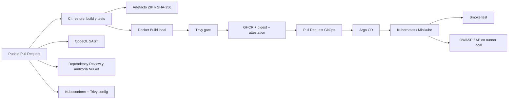

# CGA Metrology System

Aplicación académica ASP.NET Core MVC para demostrar arquitectura por capas, PostgreSQL, Docker, Kubernetes, GitOps y un flujo CI/CD con controles DevSecOps.

## Requisitos

- SDK .NET 10 (el repositorio fija el SDK mediante `global.json`).
- Docker Desktop, kubectl y Minikube para el despliegue local.
- PowerShell 7 o Bash para los scripts de validación.
- Un clúster con Argo CD para la entrega GitOps.

## Ejecución local

La contraseña de PostgreSQL no se versiona. Configúrela con User Secrets o variables de entorno:

```powershell
dotnet user-secrets set "Database:Password" "<contraseña-local>" --project CGA.MetrologySystem
dotnet restore CGA.MetrologySystem.slnx
dotnet run --project CGA.MetrologySystem
```

La aplicación escucha normalmente en `http://localhost:5123`; el endpoint operativo es `/health`.

## CI/CD DevSecOps

### Objetivo y arquitectura

GitHub Actions es la plataforma de integración continua vigente. El `Jenkinsfile` se conserva únicamente como evidencia histórica del pipeline inicial de restore/build. Git almacena el estado deseado, GHCR almacena imágenes, Argo CD sincroniza y Kubernetes ejecuta; GitHub Actions no ejecuta `kubectl apply`.



| Componente | Responsabilidad |
|---|---|
| GitHub Actions | Compilar, probar, auditar, empaquetar y proponer cambios GitOps. |
| GHCR | Almacenar `ghcr.io/<owner>/<repo>/cga-app` con tags por commit. |
| Git | Ser la fuente de verdad de `argocd-manifests/`. |
| Argo CD | Detectar, sincronizar, autocorregir y podar recursos. |
| Kubernetes | Ejecutar ASP.NET Core y PostgreSQL. |
| CodeQL | SAST sobre código C#. |
| Dependency Review / NuGet audit | Detectar riesgo introducido por paquetes. |
| Trivy | Analizar vulnerabilidades de imagen y configuraciones IaC. |
| OWASP ZAP | DAST pasivo contra la aplicación desplegada. |

### Workflows

| Workflow | Disparador | Resultado principal |
|---|---|---|
| `ci.yml` | Push/PR a `master`, manual | Build Release, TRX, Cobertura, ZIP, SHA-256 y auditoría NuGet. |
| `codeql.yml` | Push/PR a `master`, manual | Resultados SAST C# en GitHub Security. |
| `container.yml` | CI exitoso en `master`, manual confiable | Gate Trivy, imagen GHCR, digest, attestation y PR GitOps. |
| `kubernetes-validation.yml` | Cambios en `k8s/`, `argocd-manifests/` o `argocd/`, manual | Parseo YAML, kubeconform estricto y reporte Trivy config. |
| `dast.yml` | Manual | Smoke test y ZAP Baseline desde runner Windows self-hosted. |

Las pruebas xUnit usan `WebApplicationFactory` y verifican `/`, el nombre del producto, las cuatro tecnologías visibles, `/Home/Privacy` y `/health`. `dotnet test` genera TRX y cobertura Cobertura en CI.

CodeQL, Dependency Review y Trivy cubren superficies diferentes: CodeQL busca defectos en el código; Dependency Review y `dotnet list package --vulnerable` revisan componentes de terceros; Trivy inspecciona el sistema operativo y paquetes dentro de la imagen, además de políticas IaC. Dependency Review falla ante vulnerabilidades nuevas altas o críticas. El reporte NuGet se conserva incluso si el formato de auditoría cambia.

Trivy genera SARIF y tabla para `HIGH,CRITICAL`. Los hallazgos sin corrección se muestran pero no bloquean durante esta primera adopción (`ignore-unfixed`); una vulnerabilidad `CRITICAL` corregible bloquea el push. La release de `trivy-action` usada es posterior a la incidencia pública de marzo de 2026 y corresponde a una release inmutable.

### Artefactos, integridad y trazabilidad

El ZIP se denomina `cga-metrology-system-<short-sha>.zip` y se acompaña de `.sha256`. Verificación:

```bash
sha256sum --check cga-metrology-system-<short-sha>.zip.sha256
```

Un tag facilita lectura y puede moverse; un digest `sha256:...` identifica bytes inmutables. `container-metadata/image.json` relaciona imagen, digest, commit y workflow run. La imagen también lleva etiquetas OCI y una attestation de procedencia verificable con GitHub CLI:

```bash
gh attestation verify oci://ghcr.io/jossuel55/cga-jenkins/cga-app@sha256:<digest> --repo JossuEL55/CGA-Jenkins
```

### Estrategia GitOps y Argo CD

`argocd-manifests/` es la carpeta activa observada por Argo CD y conserva 4 réplicas. `k8s/` se mantiene como variante histórica/local con 2 réplicas; no es la fuente de verdad de Argo CD. Ambas se mantienen seguras y compatibles, pero todo despliegue continuo actualiza únicamente el `image` del Deployment activo.

No fue posible confirmar protección de `master` sin permisos administrativos. Por seguridad, el workflow crea `gitops/deploy-<sha>-<run>` y abre un Pull Request. Al fusionarlo, Argo CD detecta el digest nuevo. El manifiesto declarativo está en `argocd/application.yaml` y se instala una vez:

```bash
kubectl apply -f argocd/application.yaml
```

El tag inicial del manifiesto sirve como marcador de bootstrap. Después del primer CI de `master`, ejecute/espere `Container` y fusione el PR GitOps para sustituirlo por `image@sha256:digest` realmente publicado.

### Secretos, GHCR y Minikube

Antes de sincronizar, cree el Secret fuera de Git. Use credenciales académicas propias, no las copie al repositorio:

```bash
kubectl create namespace cga-metrology
kubectl -n cga-metrology create secret generic cga-postgres-secret \
  --from-literal=username=postgres \
  --from-literal=password='<contraseña-fuerte>'
```

`GITHUB_TOKEN` es suficiente para publicar si Actions tiene permisos de lectura/escritura para Packages y PRs. No se requiere PAT ni secreto adicional. GHCR no convierte automáticamente el paquete en público: en GitHub, abra **Packages → cga-app → Package settings → Change visibility → Public**. Si permanece privado, cree un pull secret y asócielo al ServiceAccount del namespace:

```bash
kubectl -n cga-metrology create secret docker-registry ghcr-pull-secret \
  --docker-server=ghcr.io --docker-username='<usuario>' --docker-password='<PAT-read-packages>'
kubectl -n cga-metrology patch serviceaccount default \
  -p '{"imagePullSecrets":[{"name":"ghcr-pull-secret"}]}'
```

Comandos de operación local:

```bash
minikube start
kubectl apply -f argocd-manifests/ -n cga-metrology
kubectl get pods -n cga-metrology
kubectl get deployments -n cga-metrology
kubectl get services -n cga-metrology
kubectl describe deployment cga-app-deployment -n cga-metrology
minikube service cga-app-service -n cga-metrology --url
```

Argo CD usa el mismo namespace mediante su destino declarado.

### Smoke test y DAST

```bash
./scripts/smoke-test.sh "$(minikube service cga-app-service -n cga-metrology --url)"
./scripts/run-zap.sh 'http://host-reachable-from-docker:30082'
```

```powershell
$url = minikube service cga-app-service -n cga-metrology --url
./scripts/smoke-test.ps1 -TargetUrl $url
./scripts/run-zap.ps1 -TargetUrl 'http://host.docker.internal:30082'
```

El workflow DAST requiere un runner GitHub Actions actualizado (2.327.1 o posterior) con etiquetas `self-hosted` y `windows`, Docker activo y acceso a Minikube. Regístrelo siguiendo **Settings → Actions → Runners → New self-hosted runner**. `target_url` debe ser alcanzable desde el contenedor ZAP; no se hardcodea localhost. ZAP Baseline usa `-I`: las alertas quedan en HTML/JSON, pero la adopción inicial no falla por warnings. Informativas y bajas se registran; medias se priorizan; altas requieren corrección o aceptación explícita antes de producción.

Más detalles operativos: [docs/devsecops-pipeline.md](docs/devsecops-pipeline.md). Evidencias académicas: [docs/evidence-checklist.md](docs/evidence-checklist.md).

### Solución de problemas

- `ImagePullBackOff`: publique el paquete o configure `ghcr-pull-secret`; confirme el digest del manifiesto.
- `CreateContainerConfigError`: cree `cga-postgres-secret` en `cga-metrology`.
- PostgreSQL no inicia: revise `kubectl logs deployment/cga-db-deployment -n cga-metrology` y los probes.
- Argo CD no sincroniza: verifique URL, `targetRevision: master`, ruta `argocd-manifests` y credenciales del repositorio.
- El PR GitOps no se crea: habilite **Workflow permissions → Read and write** y **Allow GitHub Actions to create and approve pull requests**.
- ZAP no alcanza Minikube: use una URL accesible desde Docker, port-forward expuesto al host o `host.docker.internal`; `127.0.0.1` dentro del contenedor es el propio contenedor.
- CodeQL/SARIF no publica: habilite GitHub Code Security para el repositorio y confirme `security-events: write`.
